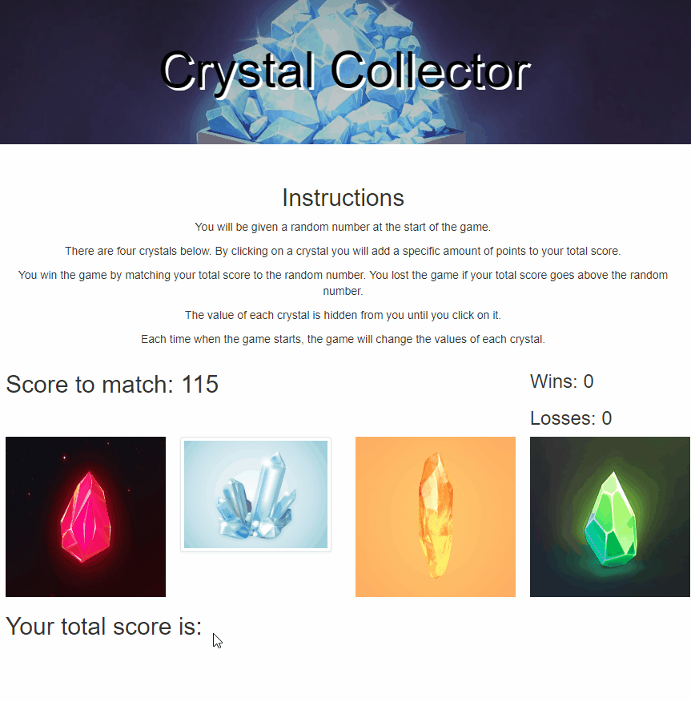

# //Crystal Collector Game

## Table of contents
  * [About this project](#about-this-project)
  * [Getting started](#getting-started)

  * [Video Demonstrations](#demo)
  * [Technologies used to create app](#technologies-used)
  * [Future code development](#feature-enhancements)
  * [Issues](#issues)
  * [Author](#author)

##  About this project

In this assignment I created a web browser game called Crystal Collector using HTML and jQuery.

##  Getting started
To play this game follow this link https://rhgcodes.github.io/unit-4-game/

##  Video Demonstrations

##  Technologies used to build app

  * HTML5
  * Bootstrap
  * JavaScript/jQuery

##  Author

* Ruben Galleguillos - *HTML/JS/jQuery* - [Ruben Galleguillos](https://github.com/rhgcodes)
